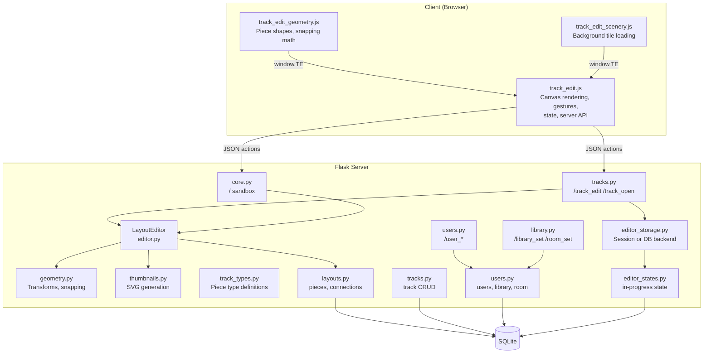
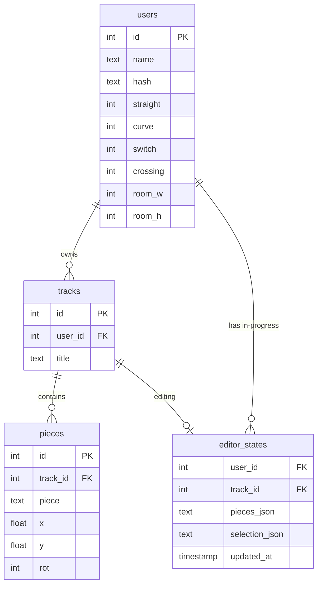
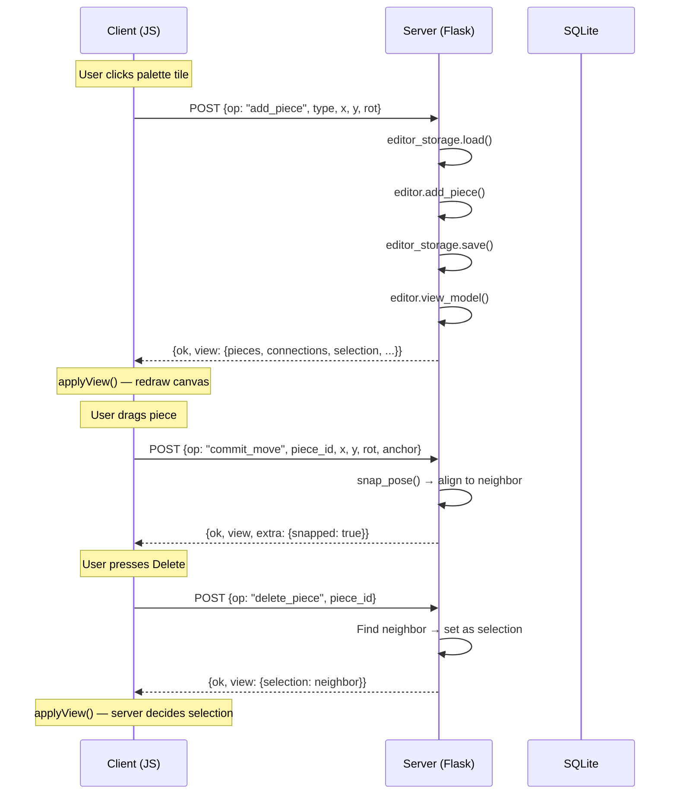
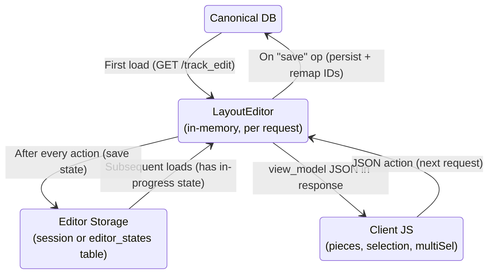
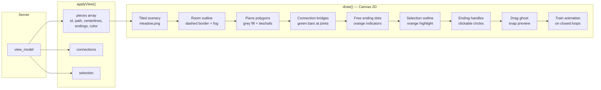
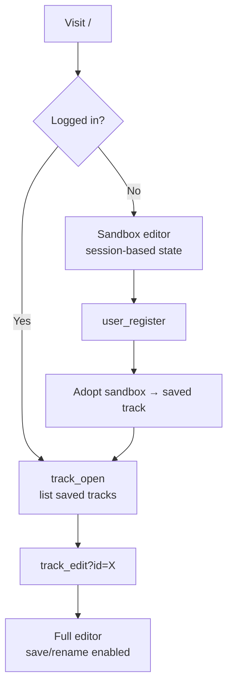

# Duplo Track Editor — Architecture

## Overview

A Flask web application for designing toy train track layouts on an HTML5 Canvas.
Users build tracks from four piece types, snap them together, and save layouts to a database.

```
┌─────────────────────────────────────────────────────────────┐
│                        Browser                              │
│  ┌──────────────┐  ┌──────────────┐  ┌───────────────────┐  │
│  │ track_edit_  │  │ track_edit_  │  │   track_edit.js   │  │
│  │ geometry.js  │→ │ scenery.js   │→ │  (canvas, state,  │  │
│  │ (piece math) │  │ (tile bg)    │  │   gestures, API)  │  │
│  └──────────────┘  └──────────────┘  └────────┬──────────┘  │
│                                       JSON actions (fetch)  │
└───────────────────────────────────────────────┼─────────────┘
                                                │
                        POST /track_edit/action  │
                        {op: "...", ...args}      │
┌───────────────────────────────────────────────┼─────────────┐
│                     Flask Server              ▼             │
│  ┌────────────┐  ┌────────────┐  ┌────────────────────────┐ │
│  │ Blueprints │→ │  Services  │→ │     Repositories       │ │
│  │ (routes)   │  │ (logic)    │  │     (SQL queries)      │ │
│  └────────────┘  └────────────┘  └────────────────────────┘ │
│                                          │                  │
│                                     SQLite DB               │
└─────────────────────────────────────────────────────────────┘
```

---

## Layered Architecture



---

## Database Schema



- **`rot`** — integer 0–11, each step = 30°
- **`pieces.piece`** — one of: `straight`, `curve`, `switch`, `crossing`
- **`editor_states`** — optional DB-backed editor state (alternative to session storage)

---

## Piece Types

| Type | Shape | Endings | Geometry |
|------|-------|---------|----------|
| **straight** | Rectangle | 2 | 10 × 40 units |
| **curve** | Arc sector | 2 | radius ≈ 77.5, 30° arc |
| **switch** | Y-junction | 3 | 1 input, 2 diverging outputs |
| **crossing** | X-intersection | 4 | 4 bidirectional endings |

**Coordinate system:** pieces are defined in local space, then transformed to
world space via `(x, y, rot)` where `rot` is in 30° steps.

**Connections** are implicit — derived at view time by finding coincident endings
(within `SNAP_TOLERANCE = 6` units).

---

## Editor Action API

Single endpoint: `POST /track_edit/action` (or `/sandbox/action` for anonymous).

Every request: `{ "op": "<name>", ...args }`
Every response: `{ "ok": true, "view": <full view_model>, "extra": {...} }`



### Operations

| Op | Args | Server behavior |
|----|------|-----------------|
| `add_piece` | type, x, y, rot | Nudge to avoid overlap, mint provisional ID, auto-select |
| `move_piece` | piece_id, x, y, rot | Live drag update (no snap) |
| `commit_move` | piece_id, x, y, rot, anchor_ending_idx | Drop with snap attempt |
| `move_pieces` | moves[] | Group drag (no snap) |
| `rotate_piece` | piece_id, delta_steps | Smart rotate around connection point |
| `delete_piece` | piece_id | Select connected neighbor or clear |
| `delete_pieces` | piece_ids[] | Batch delete, clear selection |
| `select` | piece_id, ending_idx | |
| `clear_selection` | — | |
| `save` | — | Persist to DB, remap IDs, generate thumbnail |
| `rename` | title | Validate `[A-Za-z0-9 ()]+` |

---

## State Management



### Ownership Rules

| State | Owner | Notes |
|-------|-------|-------|
| `pieces` | Server | Authoritative. Client receives full list via `view_model`. |
| `connections` | Server | Derived from coincident endings. Sent to client read-only. |
| `selection` | Server | Server decides post-delete/add selection. Client trusts `applyView()`. |
| `multiSel` | Client | Multi-select set. Pruned by `applyView()` to match server state. |
| `is_closed` | Server | Derived: true when all endings are consumed by connections. |
| `counter` | Server | Per-type piece count vs. user library. |

**Server-authoritative selection:** the client does not predict selection after
mutations (add, delete). It clears local selection, sends the action, and lets
`applyView()` apply whatever the server decided.

---

## Client-Side Rendering Pipeline



### Piece Color Coding

| Color | Meaning |
|-------|---------|
| **Grey** (`#616161`) | Piece fill (all pieces) |
| **Black** rails | Default (open track or within inventory) |
| **Red** rails | Piece count exceeds user's library inventory |
| **Green** rails | Closed loop AND all pieces within inventory |

---

## Authentication



- **Session-based auth** — `session["user_id"]`, no Flask-Login
- **`@login_required`** decorator on all track/library routes
- **Password hashing** via Werkzeug `generate_password_hash()`
- **Sandbox** — anonymous users get a fully functional editor (session-stored),
  adopted into their account on registration

---

## Directory Structure

```
duplo/
├── __init__.py              App factory (create_app)
├── auth.py                  @login_required decorator
├── extensions.py            csrf, db, limiter instances
├── blueprints/
│   ├── core.py              / and /sandbox/action
│   ├── tracks.py            /track_edit, /track_open, /track_create
│   ├── users.py             /user_register, /user_login, etc.
│   └── library.py           /library_set, /room_set
├── services/
│   ├── editor.py            LayoutEditor state machine
│   ├── editor_storage.py    Session/DB persistence
│   ├── geometry.py          Piece transforms, snapping, overlap
│   ├── thumbnails.py        SVG thumbnail generation
│   └── track_types.py       Piece type constants
└── repositories/
    ├── layouts.py            pieces table, connection derivation
    ├── tracks.py             tracks CRUD
    ├── users.py              users, library, room settings
    └── editor_states.py      in-progress editor state table

static/js/
├── track_edit_geometry.js   Client-side piece math (mirrors geometry.py)
├── track_edit_scenery.js    Background tile loading
└── track_edit.js            Canvas rendering, gestures, server API

templates/
├── track_edit.html          Editor page (canvas + palette + toolbar)
├── track_open.html          Track list with thumbnails
└── ...                      Login, register, library, etc.
```
