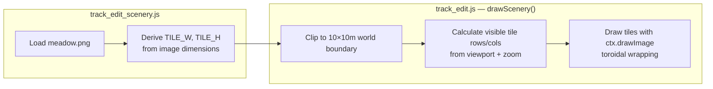

# Duplo Track Editor — Operations & Deployment

## Asset Pipeline

### Generated Assets

Three offline scripts produce static assets consumed at runtime.
All are invoked manually and their output is committed to the repo.

```
┌─────────────────────┐     ┌──────────────────────┐
│  static/tile_assets/ │     │   generate_tile.py   │
│  bird.png cow.png    │────▶│  Background removal  │
│  flower.png etc.     │     │  Base meadow render  │───▶ static/tiles/meadow.png
│  (8 sprite PNGs)     │     │  Sprite placement    │       (3750 × 2500 px)
└─────────────────────┘     └──────────────────────┘

                             ┌──────────────────────┐
                             │    piece_svgs.py      │
                             │  SVG railroad icons   │───▶ static/pieces_svg/
                             │  (ties, ballast,      │       straight.svg
                             │   rails, arcs)        │       curve.svg
                             └──────────────────────┘       switch.svg
                                                            crossing.svg

                             ┌──────────────────────┐
                             │   thumbnails.py       │
                             │  (called on save op)  │───▶ static/thumbnails/{id}.svg
                             └──────────────────────┘
```

### generate_tile.py — Meadow Background

Produces the seamless tiling background image (`static/tiles/meadow.png`).

**Three-phase process:**

1. **Background removal** — Flood-fill from corners makes sprite backgrounds
   transparent (tolerance = 8, connected-component algorithm)
2. **Base tile** — Flat green meadow (RGB 127, 191, 82) with procedural water:
   - 1 wide river (cubic B-spline), 2 narrow tributaries
   - 1 lake with ellipse highlight in the bottom-left quadrant
   - Seed-based randomization (default seed = 42)
3. **Sprite placement** — Hex-grid layout with toroidal wrapping:
   - Mountains (2), houses (2), trees (10), flowers (3)
   - Sheep (5), cows (5), horses (2), birds (2)
   - Each sprite: 50% resize, random horizontal flip, jittered ±40% within cell

**Constants:**
| Name | Value | Notes |
|------|-------|-------|
| `TILE_W` | 1875 | World-units width |
| `TILE_H` | 1250 | World-units height |
| `RES` | 2 | Pixels per world-unit |
| `MM_PER_UNIT` | 3.2 | Matches piece geometry |

**Run:** `python generate_tile.py`

### piece_svgs.py — Palette Icons

Generates SVG railroad-style icons for the palette UI.

| Type | Shape | Description |
|------|-------|-------------|
| straight | Rectangle | 2 parallel rails, brown ties, grey ballast |
| curve | 90° arc | Curved ties and dual rails |
| switch | Y-junction | Stem splits into 2 diverging arcs |
| crossing | X-intersection | 2 arms crossed at 60° |

**Styling:**
- Ties: `#6d4c41` (brown), stroke 34, dashed `5 6`
- Ballast: `#9e9e9e` (grey), width 22
- Rails: `#37474f` (dark grey), width 1.6, offset ±7 from centerline
- Viewbox: `-50 -50 100 100`

**Run:** `python piece_svgs.py`

### thumbnails.py — Track Thumbnails

Called automatically when a track is saved (`save` op). Generates an SVG from
`layouts_build()` output, auto-scaled to the bounding box with 8% padding.

**Output:** `static/thumbnails/{track_id}.svg`

---

## Scenery Rendering (Client-Side)

The meadow tile is loaded and tiled across the canvas at runtime.



**Tile dimension derivation:**
```
TILE_W = naturalWidth  / TILE_RES / 2
TILE_H = naturalHeight / TILE_RES / 2
```
where `TILE_RES = 2` (the 2× generation resolution), divided by 2 again because
the tile is drawn at half native size in the editor.

**Room overlay:** A semi-transparent fog (`rgba(255,255,255,0.35)`) masks the
world outside the user's room dimensions (default 6×4 m), with a dashed border.

---

## Static Files

```
static/
├── css/
│   ├── layout.css          Common chrome (nav, forms, tables, buttons)
│   ├── library_set.css     Library grid (2-col mobile, 4-col desktop)
│   ├── track_edit.css      Full-screen canvas editor (fixed position, HUD pills)
│   └── track_open.css      Track list grid (responsive cards)
├── js/
│   ├── track_edit_geometry.js   Piece math (mirrors server geometry.py)
│   ├── track_edit_scenery.js    Meadow tile loader
│   ├── track_edit.js            Canvas editor (rendering, gestures, API)
│   └── library_set.js           Library page (counter inputs, auto-save)
├── pieces_svg/                  Generated piece palette icons
│   ├── straight.svg
│   ├── curve.svg
│   ├── switch.svg
│   └── crossing.svg
├── tile_assets/                 Source sprites for tile generation
│   ├── bird.png    cow.png    flower.png    horse.png
│   ├── house.png   mountain.png   sheep.png    tree.png
├── tiles/
│   └── meadow.png               Generated background tile (3750×2500 px)
├── thumbnails/                  Generated per-track SVG thumbnails
├── logo.xcf                     GIMP source (not used at runtime)
└── main.xcf                     GIMP source (not used at runtime)
```

---

## Templates

| Template | Page | Notes |
|----------|------|-------|
| `layout.html` | Base | Nav bar, flash messages, footer |
| `index.html` | Home / Sandbox | Anonymous editor with default library |
| `track_edit.html` | Editor | Canvas + palette + toolbar, loads 3 JS modules |
| `track_open.html` | Track list | Grid of cards with thumbnails |
| `library_set.html` | Library | Piece count steppers, room size inputs |
| `user_login.html` | Login | Username + password form |
| `user_register.html` | Register | Name + password + confirm |
| `user_info.html` | Profile | Current library and room settings |
| `user_delete.html` | Delete account | Confirmation form |
| `error.html` | Error | HTTP error display (404, 500, etc.) |

---

## Configuration

### Environment Variables

| Variable | Default | Purpose |
|----------|---------|---------|
| `DUPLO_SECRET_KEY` | `"dev-only-do-not-use-in-prod"` | Flask session signing key (**must override in production**) |
| `DUPLO_DATABASE_URI` | `sqlite:///instance/duplo.db` | SQLAlchemy database URL |
| `DUPLO_DB_EDITOR_STATE` | `"0"` | `1` = store editor state in DB instead of session |
| `DUPLO_ASSET_VERSION` | `"dev"` | Cache-busting param appended to static URLs |
| `DUPLO_CSRF` | `"1"` | `0` = disable CSRF protection (testing only) |
| `DUPLO_RATELIMIT` | `"1"` | `0` = disable rate limiting (testing only) |

All variables are optional with dev-safe defaults. In production, at minimum
set `DUPLO_SECRET_KEY` and `DUPLO_ASSET_VERSION`.

### Asset Versioning

The `asset_url()` template helper appends `?v=<DUPLO_ASSET_VERSION>` to static
file URLs. In production, set `DUPLO_ASSET_VERSION` to a build hash or date
to bust browser caches on deploy.

---

## Database Migrations

Uses **Alembic** with raw SQL migrations (no ORM metadata).

### Migration History

| Revision | Description |
|----------|-------------|
| `0001_baseline` | Create `users`, `tracks`, `pieces`, `editor_states` tables |
| `0002_room_size` | Add `room_w` (default 6) and `room_h` (default 4) to `users` |

### Running Migrations

```bash
# Apply all pending migrations
alembic upgrade head

# Check current revision
alembic current

# Create a new migration
alembic revision -m "description"
```

Alembic reads the database URI from `DUPLO_DATABASE_URI` env var (via
`_build_db_uri()` imported from the app). Batch mode is enabled for SQLite
compatibility (`render_as_batch=True`).

---

## Deployment

### Local Development

```bash
python -m venv .venv
.venv\Scripts\activate          # Windows
pip install -r requirements.txt
alembic upgrade head
python app.py                   # http://127.0.0.1:5000, debug=True
```

### PythonAnywhere

**Entry point:** [wsgi.py](wsgi.py)

```python
from duplo import create_app
application = create_app()
```

**PythonAnywhere WSGI configuration file:**
```python
import os
os.environ["DUPLO_SECRET_KEY"] = "your-production-secret"
os.environ["DUPLO_ASSET_VERSION"] = "2026-04-28"
# os.environ["DUPLO_DATABASE_URI"] = "sqlite:///path/to/duplo.db"

from wsgi import application
```

**Deployment steps:**
1. Upload code to PythonAnywhere (git clone or zip)
2. Create virtualenv, install requirements
3. Run `alembic upgrade head` against production DB
4. Configure WSGI file with environment variables
5. Set static file mapping: URL `/static/` → `/path/to/duplo/static/`
6. Reload web app

### Production Checklist

- [ ] Set `DUPLO_SECRET_KEY` to a cryptographically random string
- [ ] Set `DUPLO_ASSET_VERSION` to current deploy hash/date
- [ ] Run `alembic upgrade head`
- [ ] Verify `instance/duplo.db` exists and is writable
- [ ] Run `python generate_tile.py` and `python piece_svgs.py` if assets are missing
- [ ] Configure PythonAnywhere static file serving for `/static/`

---

## Dependencies

| Package | Version | Purpose |
|---------|---------|---------|
| Flask | 3.0.3 | Web framework |
| Werkzeug | 3.0.4 | WSGI toolkit, password hashing |
| Jinja2 | 3.1.4 | Templates |
| SQLAlchemy | 2.0.35 | Database access (raw SQL) |
| Flask-SQLAlchemy | 3.1.1 | SQLAlchemy integration |
| Alembic | 1.13.3 | Schema migrations |
| Flask-WTF | 1.2.2 | CSRF protection |
| Flask-Session | 0.8.0 | Server-side sessions |
| Flask-Limiter | 3.10.1 | Rate limiting |
| msgspec | 0.18.6 | Fast JSON serialization |
| PyPDF2 | 3.0.1 | PDF handling |
| pytest | 9.0.3 | Test framework |
